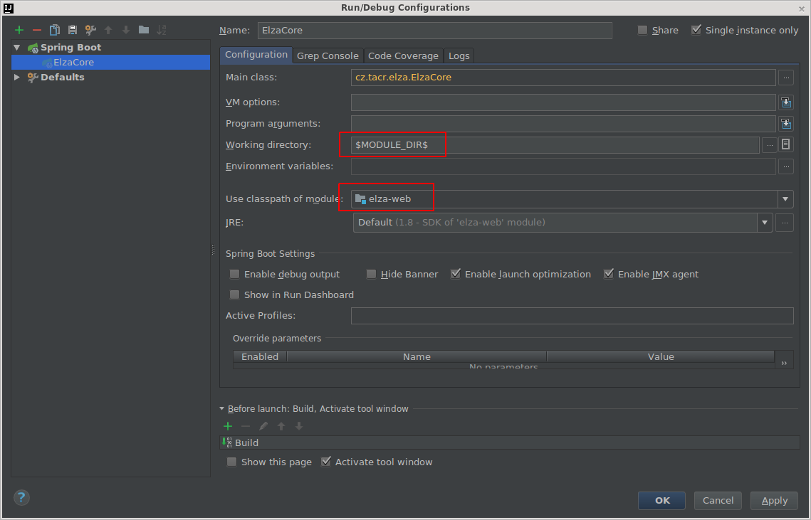

# ELZA - Elektronické zpracování archiválií

## Sestavení a spuštění

Předpokládané softwarové vybavení:

* [Git 1.9+](https://git-scm.com/download/win)
* [Oracla JDK 8](http://www.oracle.com/technetwork/java/javase/downloads/jdk8-downloads-2133151.html)
* [Apache Maven 3.2.+](https://maven.apache.org/download.cgi)
* [Node.js 20.11.0+](https://nodejs.org/)

### Získání zdrojových kódů
Příkaz:
```
git clone https://elza-developer@bitbucket.org/tacr/elza-release.git
```

### Sestavení vč dokumentace
Příkaz:
```
mvn -Pjdoc,skiptest -Dmaven.javadoc.skip=false package
```
Ve složce /target/apidocs se nachází Javadoc dokumentace, otevřete index.html.
Pro sestavení dokumentace včetně UML diagramů modelu použijte profil jdocuml (je potřeba mít nainstalován Graphviz a v PATH spustitelný dot).


### Sestavení a spuštění embed (finální UI - React), určeno pro vývoj

* Nastavení připojení k DB
V projektu elza-web je nutné v adresáři config založit soubor elza.yaml s připojením k databázi.
Podrobnosti o nastavení viz sekce 'Databázové připojení'.

* Přeložení projektu (root celého projektu) (pokud již nebylo přeloženo kvůli dokumentaci - sekce 'Sestavení vč dokumentace')
mvn install -Pskiptest

* Aktualizace NPM balíčků (v adresáři elza-react)
```
mvn exec:exec -Pnpm-install
```

* Spuštění aplikačního serveru (v adresáři elza-web)
```
mvn spring-boot:run
```

* Spuštění serveru pro frontend (v adresáři elza-react, NodeJS do v16) 
```
mvn exec:exec -Pfrontend-dev
```
* Spuštění serveru pro frontend (v adresáři elza-react, NodeJS v17+) 
```
mvn exec:exec -Pfrontend-dev-legacy
```

Po sestavení dojde ke spuštění embedded aplikačního serveru Tomcat.
Uživatelské rozhraní najdete na adrese http://localhost:8080 - není možné přistupovat z jiného počítače (sestavte a zprovozněte war v Tomcat).

#### Nastavení dev serveru klienta
V projektu elza-react pokud vytvoříme soubor `.env.development.local` máme možnost v něm konfigurovat dev server klienta.
Výchozí konfig
```
ENDPOINT=http://localhost:8080
``` 
`ENDPOINT` - kam bude komunikovat proxy pro vývoj klienta


Pokud server neběží v rootu (běží např na /elza) je možné přenastavit adresu v souboru .rescriptsrc:
        } else {
            config.output.publicPath = '/elza';  // Doplněný prefix
            return config;
        }
Současně je nutné pro vývoj upravit v souboru public/index.html a to změnit: var serverContextPath = "/elza";


### Release sestavení a spuštění war v Tomcat
V projektu elza-web je nutné v adresáři config založit soubor elza.yaml s připojením k databázi.
Podrobnosti o nastavení viz sekce 'Databázové připojení'.
Pro release v souboru elza-web/config/elza.yaml zakomentovat radek: buildType: DEV
[Deaktivovat maven blokování externích úložišť HTTP](https://stackoverflow.com/questions/67001968/how-to-disable-maven-blocking-external-http-repositories)
```
mvn -Prelease install
```

Sestavenou webovou aplikaci najdete v `distrib/elza-war/target/elza.war`.
Proveďte standardním způsobem deploy na aplikační server Tomcat verze 8.0.

### Spuštění v IDE (UI - React), určeno pro vývoj
Importujte projekt maven.
Pro spuštění jádra aplikace obsahující rest služby spusťte `cz.tacr.elza.ElzaCore`.
Pro spuštění uživatelského rozhranní spusťte `cz.tacr.elza.ElzaWebApp`.
Pro spuštění serveru pro frontend spusťte příkaz (v modulu elza-react):
```
mvn exec:exec -Pfrontend-dev
```
Uživatelské rozhranní najdete na adrese http://localhost:3000.

Nastavení spuštění serveru pro IntelliJ Idea (označené hodnoty nutno explicitně nastavit):


Pro spuštění se speciální konfigurací lze použít parametry:  `--spring.config.location=classpath:/elza.yaml,file:./config-small/elza.yaml`
První elza.yaml se načte přímo z aplikace a druhý z cesty.

### Sestavení instalátoru aplikace
* Stáhněte aplikaci Inno Setup z odkazu http://www.jrsoftware.org/download.php/is-unicode.exe a nainstalujte (všechny volby ponechte výchozí). Aplikace se nainstaluje do umístění c:\Program Files (x86)\Inno Setup 5\.
* Připravte si nainstalované lokální JRE (64-bit) a rozbalený Apache Tomcat, na které je nutné se odkázat při spuštění sestavení instalátoru. JRE a Tomcat se v rámci sestavení přidají do instalátoru a budou využívány pro běh aplikace.
* V projektu ELZA (v kořenovém adresáři) spusťte soubor ```build_instalator.bat``` nebo ručně pomocí příkazu (u obou variant je potřeba upravit cesty, aby odpovídaly reálnému umístění adresářů).
    ```
    mvn clean install -Pskiptest,release,build-instalator -Djre.path="c:/Program Files/Java/jre1.8.0_131/" -Dtomcat.path="c:/apache-tomcat/"
    ```
* Předchozím krokem dojde k sestavení aplikace a vytvoření instalátoru. Výsledný soubor instalátoru se uloží do umístění `distrib\elza-install\elza-exe\target\ELZA-<verze aplikace>.exe`

## Konfigurace a logování

Aplikace je konfigurována pomocí souboru `elza.yaml`. Umístění konfiguračních souborů:

* war Tomcat `webapps/elza/WEB-INF/classes`
* embed načítá v aktuální cestě nebo složce config

### Výchozí uživatel

Pro zakázání výchozího uživatele s právy administrátora je potřeba přidat do konfiguračního souboru `elza.security.allowDefaultUser:false`. Při použití šablony stačí pouze smazat `#`.

```
elza:
    data:
        url: jdbc:postgresql://server/databaze
        username: uzivatel
        password: heslo
    security:
        allowDefaultUser:false
```

### Pracovní adresář

Úmístění pracovního adresáře elzy lze změnit pomocí parametru `elza.workingDir`
```
elza:
    data:
        url: jdbc:postgresql://server/databaze
        username: uzivatel
        password: heslo
    workingDir: C:\Elza\work
```

### Databázový server
Od MT14 je nutné mít připravený databázový server pro datový typ Geometry.

#### PostgreSQL
Pro tento DB server je vyžadována verze 9.1 a vyšší a rozšíření [PostGis](http://postgis.net/).
Po instalaci je nutné rozšíření zprovoznit přes ```psql``` nebo PgAdmin.
Následující příkaz zprovozní rozšíření nad vybranou databází.
```
CREATE EXTENSION postgis;
```
#### MySQL
Je vyžadována verze 5.0.1 - není potřeba žádná speciální instalace.

#### Oracle
Tento DB server je vyžadována verze Enterprise. Pouze verze Enterprise umí pracovat s datovým typem Geometry.

#### MSSQL
Je vyžadována verze MSSQL 2008 - není potřeba žádná speciální instalace.

### Databázové připojení
Do konfigurace vložte nastavení datového zdroje. Při prvním připojení se datové struktury vytvoří automaticky.
Nutno také vybrat dialekt dle použité databáze.

```
elza:
    data:
        url: jdbc:postgresql://server/databaze
        username: uzivatel
        password: heslo

spring:
  jpa:
      properties:
          hibernate:
              # PostgreSQL
              dialect: org.hibernate.spatial.dialect.postgis.PostgisDialect
              # H2
              #dialect: org.hibernate.spatial.dialect.h2geodb.GeoDBDialect
              # MySQL
              #dialect: org.hibernate.spatial.dialect.mysql.MySQLSpatialDialect
              # Oracle
              #dialect: org.hibernate.spatial.dialect.oracle.OracleSpatial10gDialect
              # MSSQL
              #dialect: org.hibernate.spatial.dialect.sqlserver.SqlServer2008SpatialDialect
```

### Logování událostí
V aplikačním serveru Tomcat ve složce logs jsou archivovány logy rozdělené po jednotlivých dnech.

* `elza-stdout-...` standardní informace událostí v aplikaci
* `elza-stderr-...` chybové hlášeí v aplikaci

### Nastavení úrovně logování
Nastavení se provádí v souboru `elza.yaml`. Pro různé balíčky a třídy jdou nastavit odlišné úrovně logování. Standardně
je nastaveno logování na úroveň INFO. 

Toto nastavení zapne logování volání metod na kontrolerech:

```
logging:
  level:
    cz.tacr.elza: DEBUG
```

Nastaveni logovani do souboru pro embed server

```
logging:
  file: ${elza.workingDir}/log/elza.log
```

### Import balíčku cz-base a balíčku s pravidly
Po přeložení spuštění je potřeba naimportovat 
- balíček cz-base - soubor package-cz-base/target/elza-package-cz-base-?.zip
- základní pravidla - soubor rules-cz-zp2015/target/elza-rules-cz-zp2015-?.zip

### Import institucí
Aby bylo možné vytvářen archivní fondy, je nutné importovat instituci v sekci Osoby - soubor elza-core/src/test/resources/institution-import.xml

Importovat je možné též instituce archivů ze souboru `package-cz-base/src/all-institutions-import.xml`
